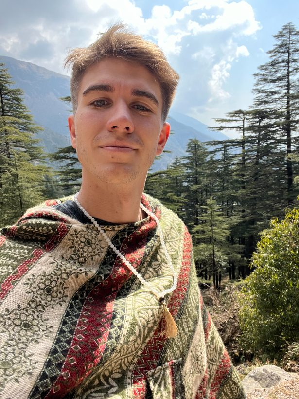
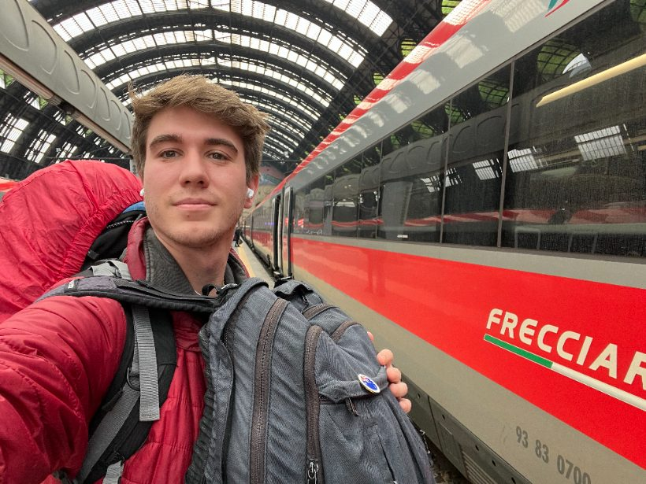
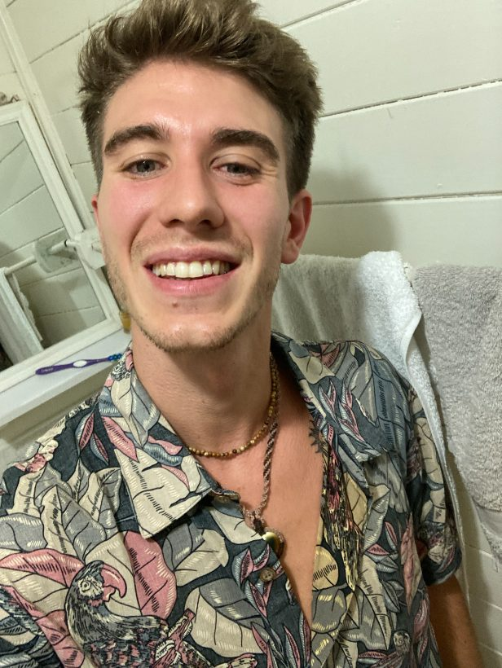
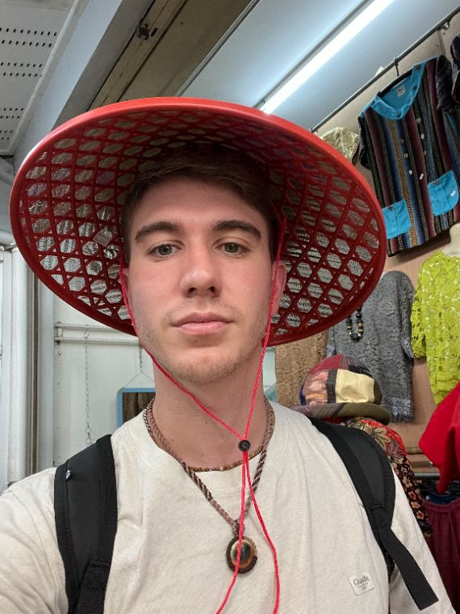
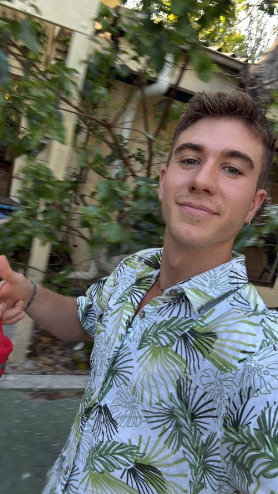
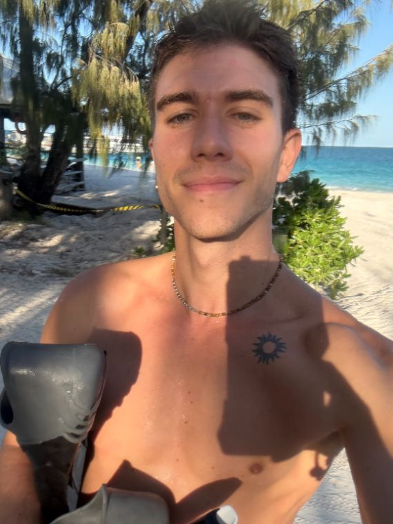
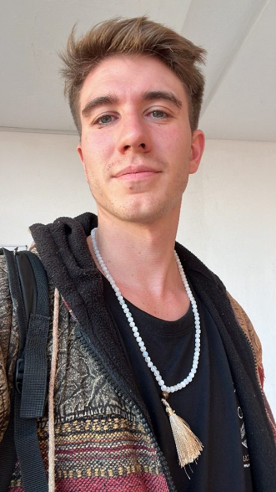
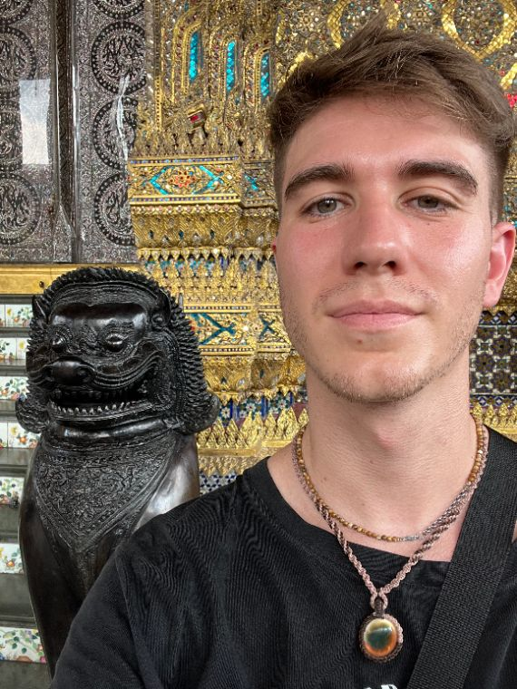
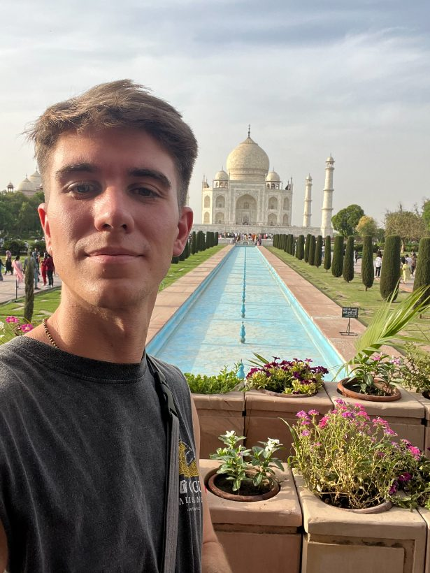

# Handoff: Hero Animation — selfies → AI headshots (`HeroTransform`)

## What this is
An animated hero visual for the headshotly.pro landing page. It loops through three phases:

1. **Input** — a messy collage of the user's everyday selfies (tilted polaroid-style cards), status: `12 selfies uploaded`
2. **Processing** — collage collapses/shrinks, a gold scan sweep passes over, status: `Training your model…`
3. **Output** — resolves into the **4 result headshots** in a 2×2 grid, each tagged `Professional` / `Cinematic` / `Natural`, status: `Your headshots are ready`

Then it loops back to input. It pauses when the tab is hidden and, under `prefers-reduced-motion`, **skips straight to the output** (no motion).

> This is a self-contained spec. Drop the component into the real Next.js landing hero (right column of `.hero-grid`). The reference implementation already exists and works — your job is to port it to a React/TS client component and wire real images.

## Files
- `README.md` — this file (full spec + explanation + the code inline)
- `code/HeroTransform.tsx` — the React/TS client component, ready to drop in
- `code/hero-transform.css` — the stylesheet it imports (commented)
- `code/demo.html` — standalone demo: **open in a browser to see it run**, no build needed
- `images/sel-1.jpg … sel-10.jpg` — the 10 photos used (already web-sized, ~820px tall, ~75–90KB). Copy into `public/hero/` (or wherever you serve hero assets).

**To ship:** copy `images/*` → `public/hero/`, drop `code/HeroTransform.tsx` + `code/hero-transform.css` into your components folder, `import "./hero-transform.css"`, and render `<HeroTransform />` in the hero's right column. Full walkthrough below.

The animation is **purely presentational** — no real upload/training happens. It's a marketing loop.

---

## Image map (which photo goes where)
**Input collage** (6 tilted cards): `sel-4, sel-5, sel-6, sel-9, sel-2, sel-10`
**Output grid** (4 results): `sel-1` (Professional), `sel-8` (Cinematic), `sel-3` (Natural), `sel-7` (Professional)

These are placeholders from a real shoot — swap for your final input selfies + result headshots anytime; the input cards should look casual/varied, the output ones should look like polished headshots. The output "style looks" (pro/cine/nat) are done with **CSS filters**, not different source files, so even the same face reads as three different styles.

---

## Tokens used (already in your `globals.css`)
`--ease`, `--radius`, `--line`, `--bg-2`, `--surface`, `--ink`, `--muted`, `--blue`, `--gold`, `--mono`. No new tokens needed.

---

## 1. CSS (verbatim — scope under your hero or a CSS module)
```css
/* Hero transform animation (selfies -> headshots) */
.hsx{position:relative;max-width:480px;margin-inline:auto;width:100%}
.hsx-stage{position:relative;width:100%;aspect-ratio:1/1.16}

/* INPUT — messy selfie collage */
.hsx-input{position:absolute;inset:0;opacity:1;transition:opacity .55s var(--ease)}
.hsx.is-output .hsx-input{opacity:0}
.hsx-card{position:absolute;width:45%;aspect-ratio:4/5;border-radius:14px;overflow:hidden;
  border:3px solid #fff;box-shadow:0 14px 30px -14px rgba(28,26,23,.45);
  transform:rotate(var(--r));transform-origin:center;
  transition:transform .9s var(--ease),opacity .7s var(--ease)}
.hsx-card img{width:100%;height:100%;object-fit:cover;display:block}
.hsx:not(.is-input) .hsx-card{transform:scale(.34) rotate(0deg);opacity:0}

/* OUTPUT — the four results */
.hsx-output{position:absolute;inset:0;display:grid;grid-template-columns:1fr 1fr;grid-template-rows:1fr 1fr;gap:16px}
.hsx-shot{position:relative;margin:0;border-radius:var(--radius);overflow:hidden;
  border:1px solid var(--line);background:var(--bg-2);
  opacity:0;transform:scale(.9) translateY(10px);
  transition:opacity .6s var(--ease),transform .6s var(--ease)}
.hsx-shot img{width:100%;height:100%;object-fit:cover;display:block}
.hsx-shot::after{content:"";position:absolute;inset:0;pointer-events:none;mix-blend-mode:soft-light}
.hsx-shot[data-style="pro"] img{filter:saturate(.92) contrast(1.05) brightness(1.06)}
.hsx-shot[data-style="pro"]::after{background:linear-gradient(180deg,rgba(180,200,232,.30),rgba(255,255,255,.04))}
.hsx-shot[data-style="cine"] img{filter:saturate(1.16) contrast(1.16) brightness(.95)}
.hsx-shot[data-style="cine"]::after{background:radial-gradient(125% 80% at 50% 32%,transparent 38%,rgba(18,13,8,.52)),linear-gradient(180deg,rgba(206,142,58,.20),transparent)}
.hsx-shot[data-style="nat"] img{filter:saturate(1.06) contrast(1.02) brightness(1.04)}
.hsx-shot[data-style="nat"]::after{background:linear-gradient(180deg,rgba(255,222,184,.20),transparent 60%)}
.hsx-cap{position:absolute;left:0;bottom:0;z-index:2;margin:10px;
  font-family:var(--mono);font-size:11px;letter-spacing:.02em;color:var(--ink);
  background:color-mix(in srgb,var(--surface) 90%,transparent);
  padding:5px 9px;border-radius:7px;border:1px solid var(--line);backdrop-filter:blur(2px)}
.hsx.is-output .hsx-shot{opacity:1;transform:none}
.hsx.is-output .hsx-shot:nth-child(1){transition-delay:.04s}
.hsx.is-output .hsx-shot:nth-child(4){transition-delay:.14s}
.hsx.is-output .hsx-shot:nth-child(2){transition-delay:.24s}
.hsx.is-output .hsx-shot:nth-child(3){transition-delay:.34s}

/* SCAN sweep during processing */
.hsx-scan{position:absolute;inset:0;border-radius:var(--radius);overflow:hidden;pointer-events:none;opacity:0;transition:opacity .3s;z-index:3}
.hsx-scan::before{content:"";position:absolute;top:-6%;bottom:-6%;left:-34%;width:34%;
  background:linear-gradient(90deg,transparent,color-mix(in srgb,var(--gold) 60%,#fff),transparent);filter:blur(3px)}
.hsx.is-processing .hsx-scan{opacity:1}
.hsx.is-processing .hsx-scan::before{animation:hsxscan 1.25s var(--ease)}
@keyframes hsxscan{from{left:-34%}to{left:112%}}

/* STATUS pill */
.hsx-status{display:flex;align-items:center;justify-content:center;gap:9px;margin-top:18px;min-height:20px;
  font-family:var(--mono);font-size:12.5px;color:var(--muted)}
.hsx-dot{width:8px;height:8px;border-radius:50%;background:var(--blue);transition:background .3s;flex:none}
.hsx[data-phase="is-processing"] .hsx-dot{background:var(--gold);animation:hsxpulse 1s ease-in-out infinite}
.hsx[data-phase="is-output"] .hsx-dot{background:#46a274}
@keyframes hsxpulse{0%,100%{opacity:1}50%{opacity:.3}}
@media (prefers-reduced-motion:reduce){.hsx-scan{display:none}.hsx-card,.hsx-shot{transition:none}}
```

---

## 2. HTML structure (reference)
```html
<div class="hsx is-input" id="hsx" data-phase="is-input" role="group"
     aria-label="Animation: from your everyday selfies to studio-quality AI headshots">
  <div class="hsx-stage">
    <!-- INPUT: 6 tilted selfie cards. left/top/--r are per-card inline styles. -->
    <div class="hsx-input" aria-hidden="true">
      <div class="hsx-card" style="left:2%;top:4%;--r:-8deg"></div>
      <div class="hsx-card" style="left:43%;top:0%;--r:6deg"></div>
      <div class="hsx-card" style="left:6%;top:39%;--r:5deg"></div>
      <div class="hsx-card" style="left:47%;top:43%;--r:-6deg"></div>
      <div class="hsx-card" style="left:25%;top:20%;--r:-2deg"></div>
      <div class="hsx-card" style="left:30%;top:50%;--r:9deg"></div>
    </div>
    <!-- OUTPUT: 4 result headshots. object-position keeps faces framed. -->
    <div class="hsx-output" aria-hidden="true">
      <figure class="hsx-shot" data-style="pro"><figcaption class="hsx-cap">Professional</figcaption></figure>
      <figure class="hsx-shot" data-style="cine"><figcaption class="hsx-cap">Cinematic</figcaption></figure>
      <figure class="hsx-shot" data-style="nat"><figcaption class="hsx-cap">Natural</figcaption></figure>
      <figure class="hsx-shot" data-style="pro"><figcaption class="hsx-cap">Professional</figcaption></figure>
    </div>
    <div class="hsx-scan" aria-hidden="true"></div>
  </div>
  <div class="hsx-status"><span class="hsx-dot"></span><span class="hsx-status-txt">12 selfies uploaded</span></div>
</div>
```

---

## 3. JS controller (reference — vanilla)
The whole thing is a class-toggle state machine on `#hsx`: it cycles `is-input → is-processing → is-output` and updates the status text + `data-phase`.
```js
(function(){
  var hsx=document.getElementById('hsx'); if(!hsx) return;
  var txt=hsx.querySelector('.hsx-status-txt');
  var reduce=window.matchMedia&&window.matchMedia('(prefers-reduced-motion: reduce)').matches;
  var phases=[
    {cls:'is-input',      t:2600, txt:'12 selfies uploaded'},
    {cls:'is-processing', t:1700, txt:'Training your model…'},
    {cls:'is-output',     t:3900, txt:'Your headshots are ready'}
  ];
  if(reduce){ // skip straight to result, no motion
    hsx.classList.remove('is-input'); hsx.classList.add('is-output');
    hsx.setAttribute('data-phase','is-output');
    if(txt) txt.textContent='Your headshots are ready';
    return;
  }
  var i=0, timer=null;
  function run(){
    var p=phases[i];
    hsx.classList.remove('is-input','is-processing','is-output');
    hsx.classList.add(p.cls);
    hsx.setAttribute('data-phase',p.cls);
    if(txt) txt.textContent=p.txt;
    timer=setTimeout(function(){ i=(i+1)%phases.length; run(); }, p.t);
  }
  run();
  document.addEventListener('visibilitychange',function(){
    if(document.hidden){ clearTimeout(timer); } else { clearTimeout(timer); run(); }
  });
})();
```
Phase durations: input **2.6s**, processing **1.7s**, output **3.9s** (full loop ≈ 8.2s). Tune to taste.

---

## 4. React/TS port (what to actually ship)
A `"use client"` component. Keep the CSS in a module or global; only the class toggle is stateful.

```tsx
"use client";
import { useEffect, useRef, useState } from "react";
import Image from "next/image";

const INPUT = [
  { src: "/hero/sel-4.jpg",  style: { left: "2%",  top: "4%",  "--r": "-8deg" } },
  { src: "/hero/sel-5.jpg",  style: { left: "43%", top: "0%",  "--r": "6deg"  } },
  { src: "/hero/sel-6.jpg",  style: { left: "6%",  top: "39%", "--r": "5deg"  } },
  { src: "/hero/sel-9.jpg",  style: { left: "47%", top: "43%", "--r": "-6deg" } },
  { src: "/hero/sel-2.jpg",  style: { left: "25%", top: "20%", "--r": "-2deg" } },
  { src: "/hero/sel-10.jpg", style: { left: "30%", top: "50%", "--r": "9deg"  } },
] as const;

const OUTPUT = [
  { src: "/hero/sel-1.jpg", style: "pro",  cap: "Professional", pos: "50% 20%" },
  { src: "/hero/sel-8.jpg", style: "cine", cap: "Cinematic",    pos: "70% 30%" },
  { src: "/hero/sel-3.jpg", style: "nat",  cap: "Natural",      pos: "50% 34%" },
  { src: "/hero/sel-7.jpg", style: "pro",  cap: "Professional", pos: "33% 30%" },
] as const;

const PHASES = [
  { cls: "is-input",      t: 2600, txt: "12 selfies uploaded" },
  { cls: "is-processing", t: 1700, txt: "Training your model…" },
  { cls: "is-output",     t: 3900, txt: "Your headshots are ready" },
] as const;

export function HeroTransform() {
  const [i, setI] = useState(0);
  const timer = useRef<ReturnType<typeof setTimeout>>();

  useEffect(() => {
    const reduce = window.matchMedia?.("(prefers-reduced-motion: reduce)").matches;
    if (reduce) { setI(2); return; }            // jump to output, no loop
    const tick = () => {
      timer.current = setTimeout(() => setI(p => (p + 1) % PHASES.length), PHASES[i].t);
    };
    tick();
    return () => clearTimeout(timer.current);
  }, [i]);

  const phase = PHASES[i].cls;
  return (
    <div className={`hsx ${phase}`} data-phase={phase} role="group"
         aria-label="Animation: from your everyday selfies to studio-quality AI headshots">
      <div className="hsx-stage">
        <div className="hsx-input" aria-hidden>
          {INPUT.map((c, n) => (
            <div key={n} className="hsx-card" style={c.style as React.CSSProperties}>
              <Image src={c.src} alt="" fill sizes="240px" style={{ objectFit: "cover" }} />
            </div>
          ))}
        </div>
        <div className="hsx-output" aria-hidden>
          {OUTPUT.map((s, n) => (
            <figure key={n} className="hsx-shot" data-style={s.style}>
              <Image src={s.src} alt={`${s.cap} AI headshot`} fill sizes="220px"
                     style={{ objectFit: "cover", objectPosition: s.pos }} />
              <figcaption className="hsx-cap">{s.cap}</figcaption>
            </figure>
          ))}
        </div>
        <div className="hsx-scan" aria-hidden />
      </div>
      <div className="hsx-status">
        <span className="hsx-dot" />
        <span className="hsx-status-txt">{PHASES[i].txt}</span>
      </div>
    </div>
  );
}
```
> Notes: with `next/image fill`, the card/shot wrappers are already `position:relative` + sized, so it drops in. The `--r` custom prop in `style` needs the `as React.CSSProperties` cast in TS. If you prefer plain ``, the verbatim HTML above works as-is.

---

## 5. Where it goes
Right column of the hero. In the current landing that's the `.hero-visual` cell of `.hero-grid` (left = copy + CTAs, right = this). It's already responsive: `max-width:480px`, centers under the copy below 920px. Replace whatever static image grid is in the hero today.

## 6. Acceptance check
- [ ] Loops input → processing (gold scan) → output (4 tagged shots) → back, smoothly
- [ ] Status pill text + dot color change per phase (blue → gold pulse → green)
- [ ] `prefers-reduced-motion`: shows the **output** state immediately, no animation
- [ ] Pauses when tab hidden, resumes on return
- [ ] Images served from `public/hero/`, `next/image`, descriptive `alt` on output shots
- [ ] No CLS: the stage holds its `aspect-ratio:1/1.16` before images load
```
```

## Prompt to paste into Claude Code
```
Add an animated hero visual to the landing page: a loop that goes from the user's
messy selfies (a tilted collage) → "processing" (gold scan sweep) → the 4 result
headshots in a 2×2 grid tagged Professional / Cinematic / Natural, then loops.

Everything you need is in design_handoff_hero_animation/README.md: the exact CSS,
the HTML structure, the JS state machine, and a ready React/TS port (HeroTransform).
The 10 images are in design_handoff_hero_animation/images/ — copy them to public/hero/.

Requirements:
- Build it as a "use client" component (HeroTransform) and place it in the right
  column of the hero (.hero-visual). Use next/image.
- Port the phase state machine exactly (durations input 2.6s / processing 1.7s /
  output 3.9s). Pause on tab hidden; under prefers-reduced-motion jump straight to
  the output state with no motion.
- Reuse existing tokens (--ease, --radius, --line, --bg-2, --surface, --ink,
  --muted, --blue, --gold, --mono). No new tokens.
- The three "style looks" are CSS filters on the same images — keep them.
- Keep descriptive alt text on the 4 output shots for SEO; input cards are aria-hidden.

Show me a plan + the diff before applying. Don't touch unrelated hero copy/CTAs.
```
